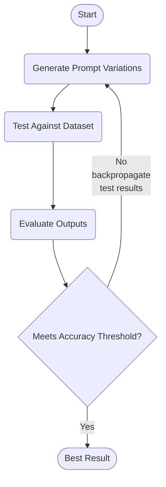

# Prompt Optimizer



## Why?

Prompt optimization is crucial for maximizing AI model performance. Different phrasings of the same request can yield vastly different responses from AI models. The Prompt Optimizer automates the process of finding the most effective prompt for a given task and model, saving time and improving output quality.

## How?

The optimizer uses a dataset consisting of cases for the prompt and expected results for each case. It generates new prompts and tests them against the dataset until it finds a highly accurate prompt that makes the target model generate expected results most consistently.

### Usage:

1. Edit the `config.py` file to set your parameters:
   - `ORIGINAL_PROMPT`: Your starting prompt
     (e.g., "Summarize the following text in one sentence: {text}")
   - `MAX_ITERATIONS`: Maximum optimization attempts
   - `PARALLEL_VARIATIONS`: Number of prompt variations to test simultaneously
   - `EVALUATION_MODEL`: Model used to evaluate outputs
   - `GENERATOR_MODEL`: Target model for optimization
   - `OPENAI_API_KEY`: Your OpenAI API key

2. Add your dataset to the `dataset.json` file. Example format:
   ```json
   [
     {
       "variables": {
         "text": "Artificial Intelligence (AI) is a field of computer science focused on creating intelligent machines that can perform tasks typically requiring human intelligence."
       },
       "expected_output": "AI creates intelligent machines to perform human-like tasks."
     },
     {
       "variables": {
         "text": "The Eiffel Tower, located in Paris, France, is one of the world's most recognizable landmarks."
       },
       "expected_output": "The Eiffel Tower is a famous Parisian landmark."
     }
   ]
   ```

3. Run the optimizer:
   ```
   python main.py
   ```

4. The optimizer will output the best performing prompt and save detailed logs.

Adjust the configuration parameters as needed for your specific use case.
